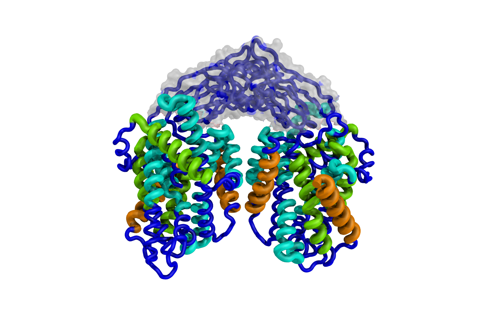

# 3D TMH Complexity

## About

This readme is out of date. Currently the scripts are in development. This readme will be updated once a stable version is achieved.

The aim is to roll out [TMSOC](http://tmsoc.bii.a-star.edu.sg/) like function into 3D protein structures. This allows us to study the role of anchors, as well as TMHs with function beyond anchorage, in 3D space. The higher the complexity, the more likely the transmembrane helix is to have function beyond anchorage.

Currently, **the software is available for Linux distributions only** since it is dependent on the `decodeanhmm` file underlying [Phobius](http://software.sbc.su.se/cgi-bin/request.cgi?project=phobius).

The script uses Phobius to estimate TMH boundaries. TMSOC is then used to assess complexity and the results are viewable in Pymol. The TMH regions are coloured accordingly:

_Figure._ Cartoon of a structure coloured according to Complexity of the TMHs.

## Installation

This software requires Linux, python3, biopython, TMSOC (included), Phobius (included), and Pymol.

## Running the script

### Overview

Move the pdb file into the `complexity_in_pymol/pymol/` directory and then run `bash runme.sh` in a terminal from the complexity_in_pymol/pymol/ folder. In Pymol, navigate to the complexity_in_pymol/pymol/ and after loading the structure enter `run bfactors.py` and then `complexb YOURSTRUCTURENAME, start position of strcutre, bfactors_YOURSTRUCTURENAME_SUBCHAIN.txt`.

<!-- ### Step by step instructions 1\. Move the PDB file you wish to work on into the Pymol directory. For example `cd Downloads/complexity_in_pymol/pymol/1a91.pdb` 2\. In a terminal, navigate to the Pymol folder. For example: `cd Downloads/complexity_in_pymol/pymol` 3\. In a terminal, run the `runme.sh`. This runs a series of commands in order and manages and logs the various input and output files. For example: `bash runme.sh`. 4\. Enter the PDB filename when prompted. If you experience an error during this process, please log it by creating a [new issue](https://github.com/jbkr/complexity_in_pymol/issues/new) on GitHub. 5\. Check that the B-factor files were generated, for example, is there a new file called `bfactors_1a91_A.txt`? 6\. Load up the Pymol application. 7\. Navigate in the application Pymol to the complexity_in_pymol/pymol directory. For example: `cd Downloads/complexity_in_pymol/pymol` 8\. In Pymol load the structure. For example: `load 1a91.pdb` 9\. In Pymol, load the B-factors script. Use `run bfactors.py` 10\. In Pymol run the bfactor function on your desired molecule. For example `complexb 1a91,1, bfactors_1a91_A.txt`. `complexb` is the command. `1a91` is te molecule name in Pymol, `1` means the starting position on that molecule is 1 (this is different for some molecules, be sure to check in the sequence viewer), and `bfactors_1a91_A.txt` is the text file generated by the shell script for that chain. The text file contains a series of numbers corresponding to loop, complex, twilight, or simple. -->

 --------------------------------------------------------------------------------

## Status

- [ ] Consensus TMH definition.

  - [ ] PDBTM integration.
  - [ ] TMHMM integration.
  - [ ] ~~SignalP filter~~
  - [x] Phobius integration.

- [x] TMSOC integration.

- [x] PyMol compatible scipt.
- [x] b-factor PDB generator indicating complexity.

--------------------------------------------------------------------------------

## Copyright

**These scripts are in development and are provided as is. Use at your own risk.**

Complexity In Pymol Copyright (C) 2017 James Alexander Baker

This program comes with ABSOLUTELY NO WARRANTY. This is free software, and you are welcome to redistribute it under certain conditions.

An unmodified copy of Phobius (provided on 3rd April 2017) is included along with these scripts. Phobius was licensed for private study, education or non-profit research only, granted to James Baker, who agreed to these conditions on <http://software.sbc.su.se/cgi-bin/request.cgi?project=phobius>

To cite Phobius:

Lukas Käll, Anders Krogh and Erik L. L. Sonnhammer. A Combined Transmembrane Topology and Signal Peptide Prediction Method. Journal of Molecular Biology, 338(5):1027-1036, May 2004.
